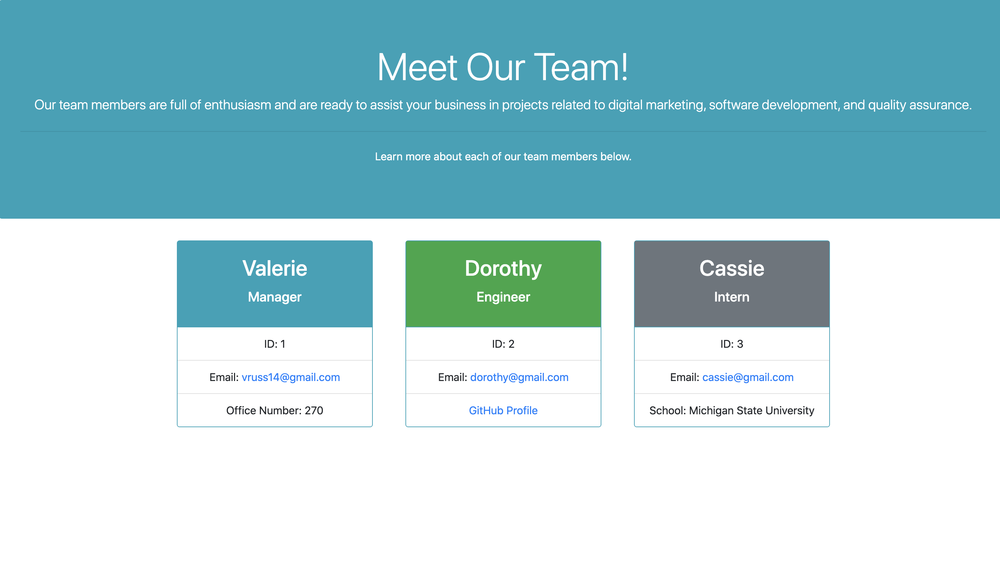

# Team Profiles

## Description

This application utilizes Node.js to dynamically generate an HTML page based on user inputs. By answering questions in the command line, users can create a roster of team members within their company. While this application only includes managers, engineers, and interns, it could be modified to fit the job titles of other companies. By answering the several provided questions, the user is able to generate an easy-to-read page that provides contact information and relevant information for each of their team members. To create this application, I used HTML5, Bootstrap, Node.js, inquirer, and jest.

This application was definitely challenging for me to create. I learned a lot about the value of constructor functions and classes, and I also learned how to create relevant tests for each file. While these things were intimidating for me at first, I now understand the patterns behind these tools. Creating this project was an excellent opportunity for me to learn when and how to use these tools.

I see many opportunities for future development for this project, including:

- Adding job titles
- Error handling
- Creating a more complex and interesting HTML page layout

Overall, I grew a lot from building this application. I am excited to continue to implement what I have learned in future projects.

## Table of Contents

- [Installation](#Installation)
- [Usage](#Usage)
- [License](#License)
- [Contributing](#Contributing)
- [Tests](#Tests)
- [Questions](#Questions)
            
## Installation

For this application to run correctly, run ```npm init -y ``` in the working directory of your choice. Next, install the relevant dependencies by running ```npm i```. Alternatively, you can install the dependencies one at a time: ```npm install inquirer``` and ```npm jest```.

Please note that it may take a few minutes for jest to download on your local machine. 

To start the application from the command line after installations have been complete, run ```node index.js```
            
## Usage

This application can be used to generate a team roster that includes one manager, as well as engineers and interns. A video detailing how the application is intended to be used can be found here: https://drive.google.com/file/d/1-e_hyj97t8jFzLdeL6nU9WEBPUMkNmQp/view

Below is an example HTML page that was rendered through using this application:




## License

This project has not yet been licensed, and thus, standard copyright laws apply.
            
## Contributing

Valerie Russell is the sole contributor to this project.
            
## Tests

Tests for this project are contained within the tests folder. To run the tests, navigate to the correct directory in the command line and run ```npm test -- nameoftestfile``` or ```npm test``` (if you would like to test all of the files at once.)
            
## Questions

If you have any questions about this application my GitHub username is
vruss14 and you can view my GitHub profile at https://github.com/vruss14.

If you have additional questions, feel free to reach out to me at vruss14@gmail.com.
